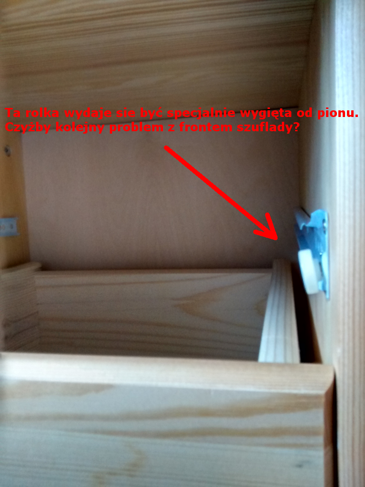

Kupiłem biurko na Allegro od 

MEBELEK Firma Handlowa
Toporzysko 568
34-240 Jordanów
REGON: 122431300
NIP: 553-213-56-77

Biurko miało wygląać tak:

Przedstawiam tu zdjęcia fuszer popełnionych przez producenta:

Półka od klawiatury jest o 3cm za szeroka, gdyż blat biurka jest o 3cm za krótki: miał być długi na 140cm a wyszedł na 137cm. Otwory montażowe do połączenia blatu z resztą biurka (szafka i szuflady) pewnie są nawiercane według schematu: wiercić X centymetrów od brzegu blatu. Skoro blat wyszedł krótszy, to zmiejszyła się przestrzeń na półkę pod klawiaturę. Heh. Jeden magik wyciął za krótki blat, a drugi magik wyciął poprawnie półkę pod klawiaturę. Nie dogadali się jednak i wyszło, jak zwykle.
